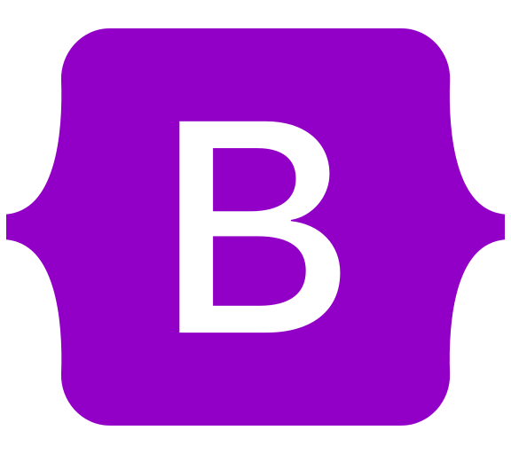

# ¡Hola!, Mi nombre es Cristian Mora 👋
## _FullStack Developer_ 💻

Soy Full-Stack Web Developer. Me siento cómodo trabajando en Front-end y en Back-end. Experimentado en crear aplicaciones web probando distintas herramientas para el desarrollo y solución de problemas. Trabajo con: Html, CSS, JavaScript, Postgres, Git.  Frameworks y CMS: ReactJS, React Native, Express, Bootstrap, Material UI. Siempre dispuesto a aprender nuevas herramientas y soluciones.

### Tecnologías 

- HTML
- CSS
- SASS
- BOOTSTRAP
- JAVASCRIPT
- REACTJS
- REDUX
- NODEJS
- EXPRESS
- POSTGRESQL

     

## Contáctame

Correo Electrónico: cristianmmst@gmail.com

